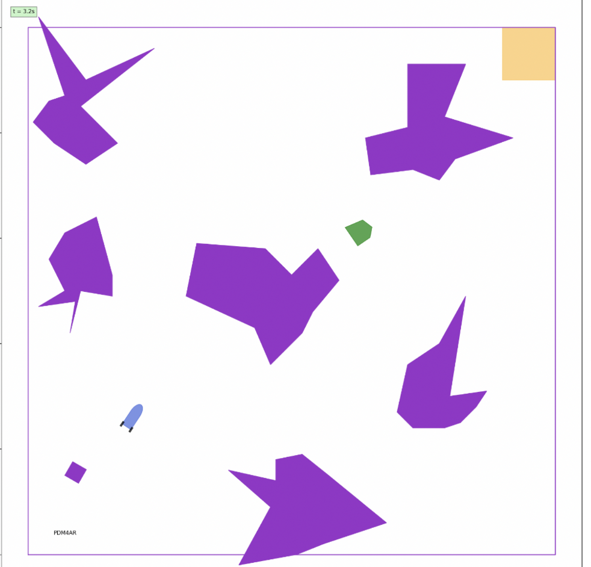
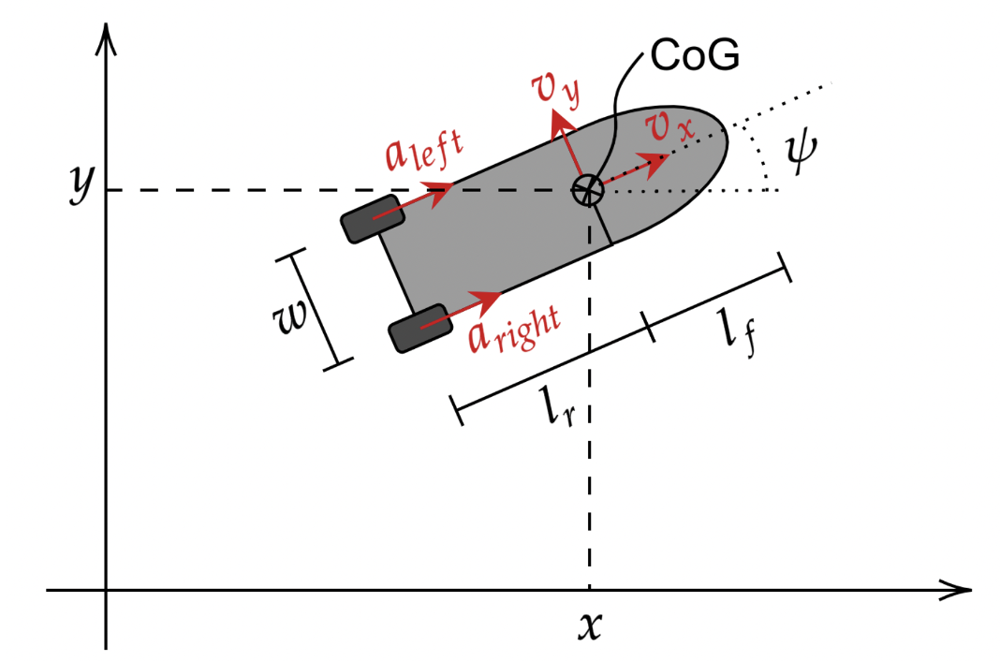
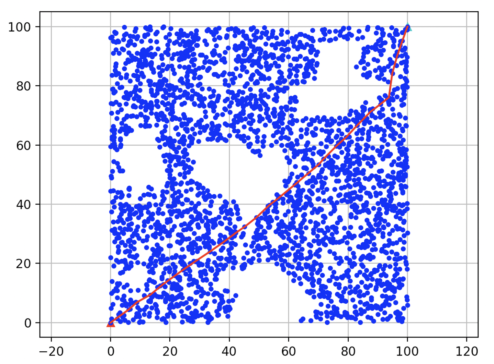
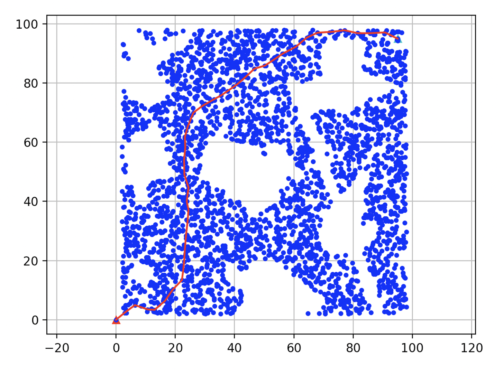

# Planning and Decision Making for Autonomous Robots
In this project we desgin a planning and control algorithm for a small spacecraft which is unexpectedly surrounded by a field of asteroids at the moment of arrival. To safely arrive the docking area and avoid the obstacles we design a planner which can do online path planning and dynamic control.

score: 0.25/0.25


# Introduction
 \

As you can see above the blue rocket is the agent, purple polygon is static obstacle while the green polygon is dynamic obstacle. The beige area is the destination.
Challenge
- The dynamic obstacle and its trajectory is unknown.
- The geometry of the spacecraft is corrupted with noise.
- The spacecraft size is crucial when passing some narrow passages.

 

The state of the spacecraft is described by:
```python
@dataclass
class SpacecraftState:
    x: float
    """ CoG x location [m] """
    y: float
    """ CoG y location [m] """
    psi: float
    """ Heading (yaw) [rad] """
    vx: float
    """ CoG longitudinal velocity [m/s] """
    vy: float
    """ CoG longitudinal velocity [m/s] """
    dpsi: float
    """ Heading (yaw) rate [rad/s] """
```
The commands (actuation) are:
```python
@dataclass
class SpacecraftCommands:
    acc_left: float
    """ linear acceleration of the left thruster [m/s^2] """
    acc_right: float
    ""
```
# Planning
We use the adapted PRM Algorithm for planning the trajectory. As figure shows below:

 

 

After sample enough points in the map we then use Dijkstra's algorithm for path planning. In this case we add one safe potential term to enforce the path stay away from the obstacle in a safe range (considering the spacecraft size if too close to obstacle might crash ). And you can see the difference between above figures. The first one is without safe constraint so it go through the narrow passage which leads to a collision while the second figure shows the safer path.

Furthermore we run this path planning multiple times to avoid the dynamic obstacles

# Control

We use the PID control with feedback to solve the noisy geometry.


